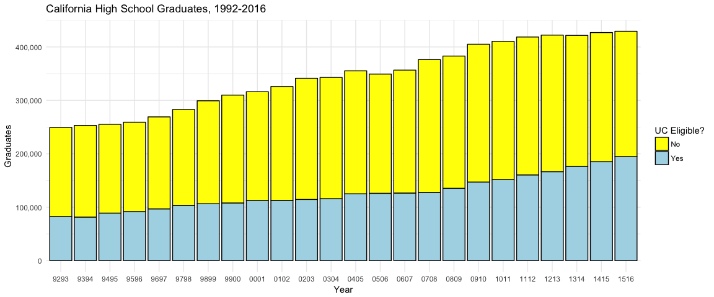
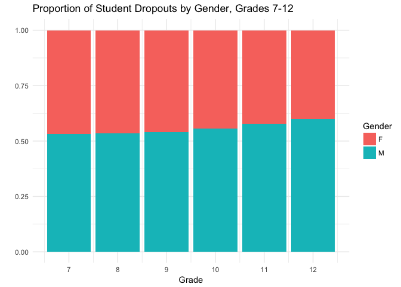

<!-- README.md is generated from README.Rmd. Please edit that file -->
The California Department of Education in R
===========================================


The California Department of Education provides ample data. Now, that data is available in R.

Installation
------------

``` r
devtools::install_github("daranzolin/rCAEDDATA")
library(rCAEDDATA)
```

Available Datasets
------------------

-   [Cohort Outcome Data ("cohorts")](http://www.cde.ca.gov/ds/sd/sd/filescohort.asp) -- California Longitudinal Pupil Achievement Data System (CALPADS) cohort outcome data reported by race/ethnicity, program participation, and gender.

-   [Dropouts by Race and Gender ("dropouts")](http://www.cde.ca.gov/ds/sd/sd/filesdropouts.asp) -- Data for grade seven through twelve dropouts and enrollment by race/ethnic designation and gender by school.

-   [English Learners by Grade and Language ("english\_learners")](http://www.cde.ca.gov/ds/sd/sd/fileselsch.asp) -- Data for English learners (ELs) by grade, language, and school.

-   [Enrollment by School ("enrollments")](http://www.cde.ca.gov/ds/sd/sd/filesenr.asp) -- Data for school-level enrollment by racial/ethnic designation, gender, and grade.

-   [Student Poverty FRPM ("frpm")](http://www.cde.ca.gov/ds/sd/sd/filessp.asp) -- Data for students eligible for Free or Reduced Price Meals (FRPM).

-   [Graduates by Race and Gender ("graduates")](http://www.cde.ca.gov/ds/sd/sd/filesgrads.asp) -- Data for graduates and graduates meeting University of California (UC)/California State University (CSU) entrance requirements by race/ethnic designation and gender by school.

-   [Primary and Short-Term Enrollment ("primary\_and\_short\_term")](http://www.cde.ca.gov/ds/sd/sd/filesenrps.asp) -- Data for primary and short-term school-level enrollment by racial/ethnic designation, gender, and grade.

Examples
--------

### Graduates

``` r
library(rCAEDDATA)
library(tidyverse)
#> Loading tidyverse: ggplot2
#> Loading tidyverse: tibble
#> Loading tidyverse: tidyr
#> Loading tidyverse: readr
#> Loading tidyverse: purrr
#> Loading tidyverse: dplyr
#> Conflicts with tidy packages ----------------------------------------------
#> filter(): dplyr, stats
#> lag():    dplyr, stats
data("graduates")
graduates %>% 
  group_by(YEAR) %>% 
  summarize(total_grads = sum(GRADS),
            Yes = sum(UC_GRADS),
            No = total_grads - Yes) %>%
  select(-total_grads) %>% 
  gather(Eligibility, Graduates, -YEAR) %>% 
  ggplot(aes(YEAR, Graduates, fill = Eligibility)) +
  geom_bar(stat = "identity", color = "black") +
  labs(x = "Year",
       y = "Graduates",
       title = "California High School Graduates, 1992-2016",
       fill = "UC Eligible?") +
  scale_y_continuous(labels = scales::comma) +
  scale_fill_manual(values = c("yellow", "lightblue")) +
  theme_minimal() 
```



### Dropouts

``` r
data("dropouts")
dropouts %>% 
  select(GENDER, matches("D[0-9]{1,2}")) %>% 
  gather(GRADE, DROPOUTS, -GENDER) %>% 
  mutate(GRADE = as.numeric(stringr::str_replace(GRADE, "D", ""))) %>% 
  group_by(GENDER, GRADE) %>% 
  summarize(DROPOUTS = sum(DROPOUTS)) %>% 
  ggplot(aes(GRADE, DROPOUTS, fill = GENDER)) +
  geom_bar(stat = "identity", position = "fill") +
  scale_x_continuous(breaks = c(7:12)) +
  labs(x = "Grade",
       y = "",
       title = "Proportion of Student Dropouts by Gender, Grades 7-12",
       fill = "Gender") +
  theme_minimal()
```


